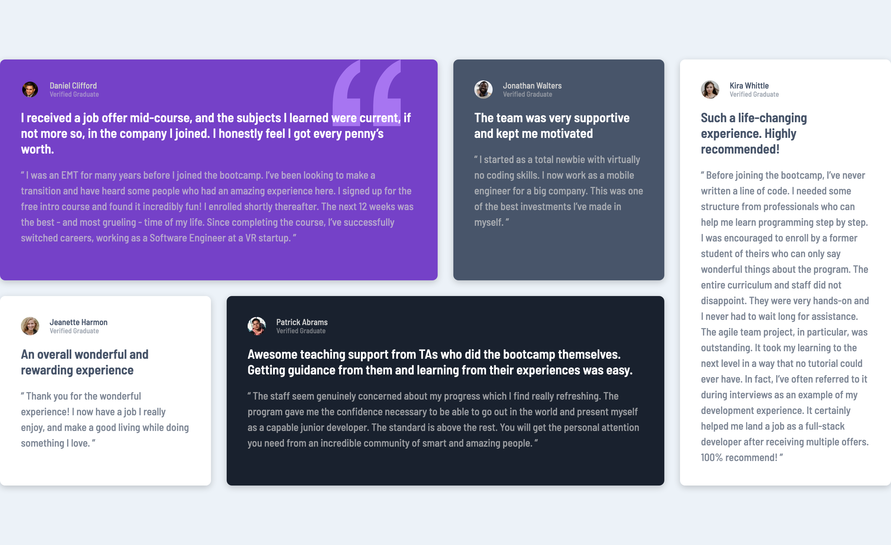

# Frontend Mentor - Testimonials grid section solution

This is a solution to the [Testimonials grid section challenge on Frontend Mentor](https://www.frontendmentor.io/challenges/testimonials-grid-section-Nnw6J7Un7). Frontend Mentor challenges help you improve your coding skills by building realistic projects. 

## Table of contents

- [Overview](#overview)
  - [The challenge](#the-challenge)
  - [Screenshot](#screenshot)
  - [Links](#links)
- [My process](#my-process)
  - [Built with](#built-with)
  - [What I learned](#what-i-learned)
  - [Continued development](#continued-development)
  - [Useful resources](#useful-resources)
- [Author](#author)

**Note: Delete this note and update the table of contents based on what sections you keep.**

## Overview

### The challenge

Users should be able to:

- View the optimal layout for the site depending on their device's screen size

### Screenshot



### Links

- [Solution](https://github.com/ryanthayes/fem-testimonials-grid-section)
- [Live URL](https://ryanthayes.github.io/fem-testimonials-grid-section)

## My process

### Built with

- Semantic HTML5 markup
- CSS custom properties
- Flexbox
- CSS Grid
- Mobile-first workflow

### What I learned

I used this project to learn more about CSS Grids. I learned to start simple. Start with grid-template-columns and don't worry about rows unless you have to. I learned that when working with grids that the development tools in Firefox are invaluable. 

```css
.testimonial-grid {
  display: grid;
  gap: 1.5rem;
  grid-template-columns: repeat(4, 1fr);
}
```

The layout section with grid overlay is key to visualizing how to span content. It took a little while to figure out how to move and span content to different grid sections to match teh design. I experimented with long hand and short hand of grid column and grid row, but on the final code I cleaned it up to be short hand.

```css
 .testimonial:last-child {
    grid-column: 4;
    grid-row: 1 / 3;
  }
  .grid-col-span-2 {
    grid-column: span 2;
  }
  ```

I also simplified my CSS custom attributes for alpha colors from the last project and commented each color to match the style guide. 

```css
/* define custom variables */
:root {

  --clr-neutral-100: hsl(0, 0%, 100%); /* white */
  --clr-neutral-200: hsl(210, 46%, 95%); /* light light gray */
  --clr-neutral-300: hsl(0, 0%, 81%); /* light gray */
  --clr-neutral-300-alpha50: hsl(0, 0%, 81%, 0.5); /* light gray alpha 50%*/
  --clr-neutral-300-alpha70: hsl(0, 0%, 81%, 0.7); /* light gray alpha 70%*/
  --clr-neutral-400: hsl(200, 60%, 1%); /* light grayish blue */

  --clr-primary-400: hsl(263, 55%, 52%); /* moderate violet */
  --clr-primary-400-alpha50: hsla(263, 55%, 52%, 0.5); /* moderate violet */
  --clr-primary-600: hsl(217, 19%, 35%); /* very dark grayish blue */
  --clr-primary-600-alpha50: hsl(217, 19%, 35%, 0.5); /* very dark grayish blue alpha 50%*/
  --clr-primary-600-alpha70: hsl(217, 19%, 35%, 0.7); /* very dark grayish blue alpha 70% */
  --clr-primary-800: hsl(219, 29%, 14%); /* very dark blackish blue */

  --ff-primary: 'Barlow Semi Condensed', sans-serif;

  --fs-300: 0.6875rem;
  --fs-400: 0.8125rem;
  --fs-500: 1.25rem;

  --fw-normal: 500;
  --fw-semi-bold: 600;

  --padding1: 1rem;
  --padding2: 2rem;
  --padding3: 3rem;
}
```
### Continued development

This was my first real practice with grids. I need to do some more projects to reinforce the concepts. I am also not sure on the best approach to styling the individual testimonial sections. I used "nth child" to select and code, but I saw another method using utility classes. I am not sure what is considered best practices.

### Useful resources

[Learn CSS Grid the easy way](https://www.youtube.com/watch?v=rg7Fvvl3taU) - I lucked out that Kevin Powell just happened to use this same project when teaching CSS Grids. I had already completed the HTML and basic styling, I then got stuck on grids when I searched YouTube. I have been using his tutorials as my "go to" resource for learning CSS. Besides his clear and concise teaching, I like how he defines CSS custom properties from the start based off teh design and style guide. It really does simplify things later on. I also like how he approaches doing even small projects with an eye to them possibly becoming bigger projects in the future. I could do some of these smaller front end mentor projects with simpler code, but I want to practice like I am going to be working on bigger projects in the future.

## Author

- Github - [@ryanthayes](https://github.com/ryanthayes)
- Frontend Mentor - [@ryanthayes](https://www.frontendmentor.io/profile/ryanthayes)
